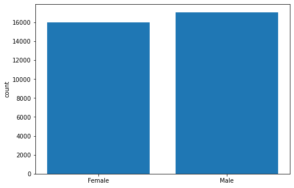
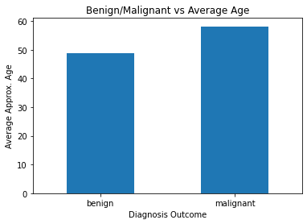
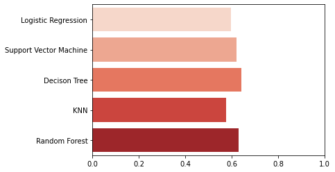
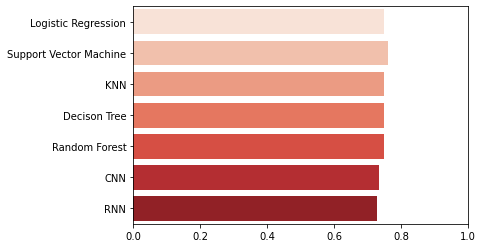

# MoleVision 🦋🔍

## Overview

MoleVision is a project that aims to predict whether a given skin lesion image is benign or malignant using machine learning techniques.The challenge2020 dataset resized to 512x512 is available here on kaggle [SIIM-ISIC Melanoma Classification](https://www.kaggle.com/competitions/siim-isic-melanoma-classification/overview) is a dataset used in machine learning to predict whether an image of a skin lesion is melanoma or not. The dataset contains a total of 33,126 images of skin lesions, where 32,312 are benign and 814 are malignant.

Dataset - <https://challenge2020.isic-archive.com/>

## Goals

1. Collect data and conduct data analysis. Visual reports.
1. Evaluate Classifica.on Models (Decision Trees, Random Forests, Linear Regression) with Deep Learning Models (CNN, RNN etc) and based on the outcome Design and implement one or more deep learning systems, experiment with various algorithms to maximize the learning capability. Evaluate the performance and document findings.
1. Cost functions should be carefully thought through and justified.
1. Image segmentation or object detection can be carried out to extract the pathological regions for refined detection and analysis.
1. Evaluate if addition or integration of demographic information such as age, ethnic groups, gender etc. may give better predictions.
1. Explore unsupervised learning on large unlabelled data.
1. Fine tuning on a limited source of pathological data.

## DatasetOverview

Images are also provided in JPEG resized a uniform 512x512..

Metadata is also provided outside of the JPEG format, in CSVfiles. See the Columns section for a description.

We have to predict a binary target for each image. The model model should predict the probability (floating point) between 0.0 and 1.0 that the lesion in the image is malignant (the target). In the training data, train.csv, the value 0 denotes benign, and 1 indicates malignant.

### Metadata:

- **image\_name** - unique identifier, points to filename of related DICOM image
- **patient\_id** - unique patient identifier
- **sex** - the sex of the patient (when unknown, will be blank)
- **age\_approx** - approximate patient age at time of imaging
- **anatom\_site\_general\_challenge** - location of imaged site
- **diagnosis** - detailed diagnosis information (train only)
- **benign\_malignant** - indicator of malignancy of imaged lesion
- **target** - binarized version of the target variable

## ExploratoryDataAnalysis

Before coming to Machine learning I have to understand what type of data we are dealing with and how it is correlated with itself.

No of samples taken from patients frequency

Observing the number of patients and no of total samples, Icame to the following insights.

- All the patients gave at least **2 samples.**
- Maximum no of samples taken from a single patient is **115.**
- On an average each patient gave **16 samples**
- Median of samples of image per patient is **12**
- Mode of samples of image per patient is **3**

### [AgeDistribution](AgeDistribution)

The distribution of patients is almost equal the sample dataset has a balanced distribution of patients based on their gender

DistributionofPatientsbyGender

Here we observe that among the unique patients providing samples,

- **Melanoma** is more prevalent in Women
- Among the Male patients, almost **24%**are at malignant stage
- On the other hand, among Female patients, about **17%**are at **malignant stage**

Here we see that comparatively malignant patients are of higher age and their average age is almost **57 years** whereas average age of the benign patients is close to **50**.

We can see that oral/genital and palms/soles are least likely to develop Melanoma disease whereas most of the time torso develops melanoma

### VisualizingSomeImages

Benign:

Malignant:

### DataProcessing

1. Balance the dataset to have 50 % malignant and 50 % benign images
1. Check for Missing Values.
1. Remove missing values.
1. Convert the categorical to numerical.

Training\_samples - 966 Validation\_sample - 230 Test Samples = 184

There are Three Different Evaluations Done.

1. Raw and augmented images.
1. Features from images extracted using Vg166 pretrained model on imagenet dataset
1. Tabular Dataset

## EvaluationModels

**Images:**

These results are trained on images of size **(512,512,3)** resized to **(224,224,3)** and then augmented and preprocessed to smaller size.

Most have test\_accuracy of about 0,62 percent.

**TabularData:**

These results are trained on Attributes in csv file

- sex
- anatom\_head/neck
- anatom\_lower extremity
- anatom\_oral/genital
- anatom\_palms/soles
- anatom\_torso
- anatom\_upper extremity
- Age

Encodings with anatom prefix are hot encodings of where the tumor is present. The most common location is torso as seen above in EDA.

**ImagesFeaturesExtractedFromVGG16:**

These results are trained on images of size **(512,512,3)** resized to **(224,224,3)** and then augmented and preprocessed through a pretrained model to get the features of the last layer and which is then used to predict the class.

.

Most have test\_accuracy of about 0,75 percent.

## FeatureExtraction

Instead of using object detection or segmentation we are using the features extracted at the last layer of pretrained vgg16 on imagenet dataset. It serves the same purpose and makes it easy for us to identify the Image.

## KMeansonUnlabelledData

Iused KMeans Clustering on unlabelled images. The input is a raw image of size 224,224,3. **Number of Clusters was set to 2.**

**Metric of Determination: Silhouette**

**Silhouette score: 0.5170565367581895**

Ascore of 0.517 means that the clustering has produced reasonably well-separated clusters, but there is still room for improvement.

## TransferLearningusingResnet50

To improve performance, Iused resnet50 with weights from imagenet dataset and fine tuned it on my dataset. The inputs are raw images of size 224,224,3 which are processed and augmented.

**Test Accuracy: 0.77.**

This is the best model. On raw images it performed better and gave an accuracy of 0.77 compared to other models with an average of 0.65 on raw images.

## EnsemblingModels

Kaggle's Melanoma Classification competition provides both image data and tabular data about each sample. Our task is to use both types of data to predict the probability that a sample is malignant. How can we build a model that uses both images and tabular data?

Three ideas come to mind.

1. Build a CNN image model and find a way to input the tabular data into the CNN image model
1. Build a Tabular data model and find a way to extract image embeddings and input into the Tabular data model
1. Build 2 separate models and ensemble We will do the third one.

We are ensembling 2 model results based on weighted average **Results from XGBoost (Decision Tree):**

### Results from Transfer Learning using Resnet50

Combining Both based on Weighted Average Resnet Results are given more weight. This gives us better predictions by ensembling these 2 models

